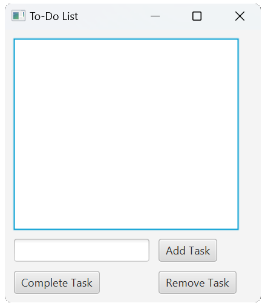
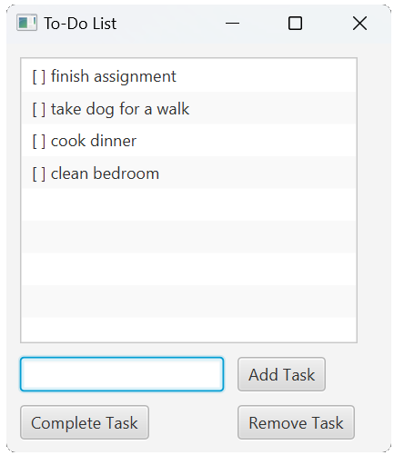
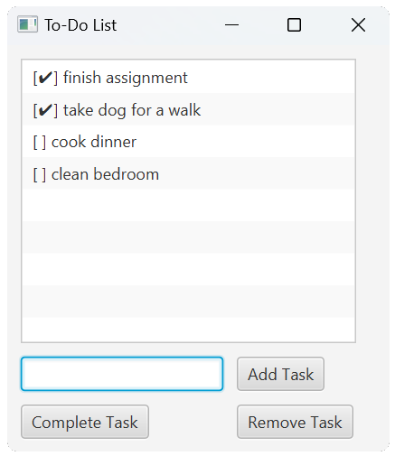
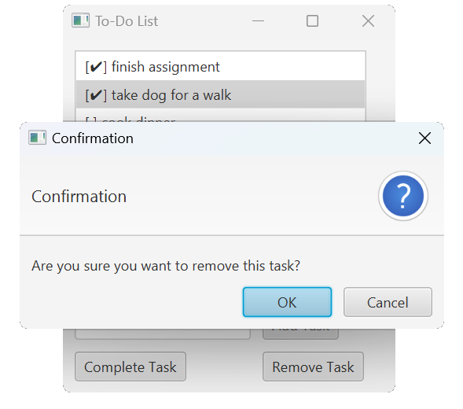

# 📋 To-Do List Application

A simple To-Do List application built with JavaFX. This application allows users to add, complete, and remove tasks while providing a user-friendly interface.

## 📸 Screenshots

<table>
    <tr>
        <td></td>
        <td></td>
        <td></td>
        <td></td>
    </tr>
</table>

## 📜 Features

- **➕ Add Tasks**: Easily add new tasks to your list.
- **✅ Complete Tasks**: Mark tasks as completed.
- **➖ Remove Tasks**: Delete tasks from the list.
- **📱 User-Friendly Interface**: Simple interface. Modern interface updates coming soon.

## 🛠️ Technologies Used

- Java
- JavaFX
- Scene Builder (optional for layout design)

## ⏩ Getting Started

### Prerequisites

- Java Development Kit (JDK) 11 or higher
- JavaFX SDK

### Installation

1. Clone the repository:

   ```bash
   git clone https://github.com/yourusername/todo-app.git
   ```
